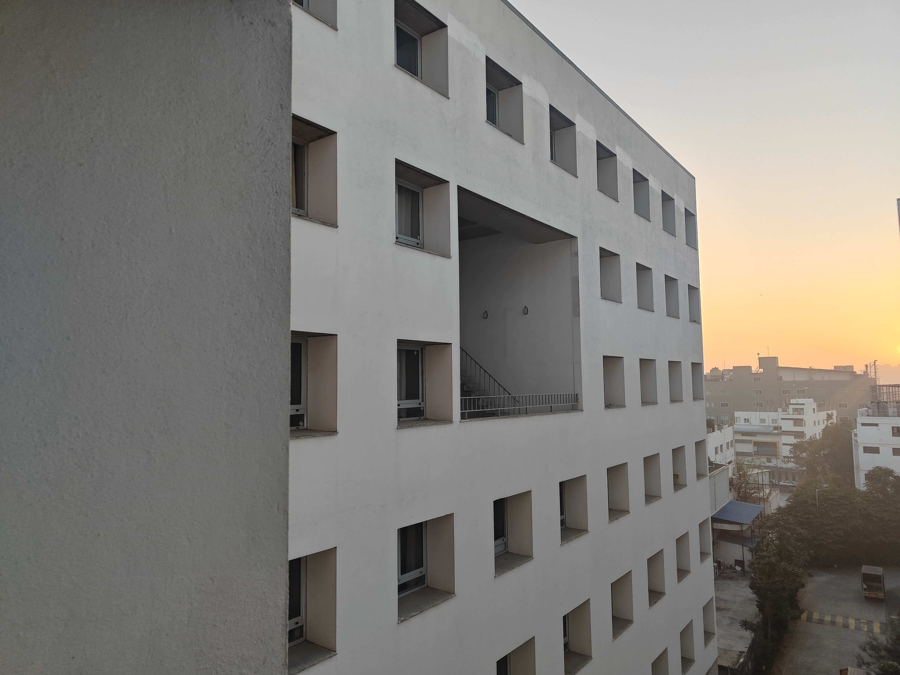

# AIM 825- Sec-A: Visual Recognition

# Assignment-1

<h3 align="center">Varsha Yamsani</h3>
<h3 align="center">IMT2022506</h3>
<h3 align="center">Yamsani.Varsha@iiitb.ac.in</h3>

## Introduction

The goal of this assignment is to analyze and process images using computer vision techniques for two tasks: coin detection and segmentation, and image stitching. In the first
part, edge detection is applied to identify coins, followed by region-based segmentation to
isolate individual coins, and a counting function to determine the total number of coins in
the image. In the second part, key points are extracted from overlapping images to align
and stitch them into a seamless panorama.

## Question 1

### Code workflow Description:
- **Loading the data**: A total of five images were sourced from the web and captured
    manually to detect and count coins.
- **Preprocessing the image**: 
    - The image was first converted to grayscale and then blurred using a Gaussian blur with a 15×15 kernel and a standard deviation of 7 to reduce noise.
    - Next, the grayscale image was converted into a binary (black and white)
       image. The **THRESH_OTSU** method automatically determined the optimal threshold value, while **THRESH_BINARY_INV** ensured that the
       background appeared black and the objects of interest (coins) appeared
       white.
    - To remove noise and fill gaps in the objects, **Morphological Closing** was
       applied using two iterations: <br>
       - **Dilating**: Expands the white regions by growing object boundaries.<br>
       - **Erosion**:  Shrinks the white regions back to their original size, refining the segmentation.
- **Edge detection**:  Canny Edge detector was used for edge detection, where only
    edges between 120 and 250 are used as strong edges.
- **Image Segmentation**:  Using the binary image, we find a list of detected contours(ignoring the outermost contours). We create a dummy black image which is
    of the same size as grayscale image, and that image will be used to draw and fill
    the detected contours.
- **Counting Coins**: Contours are created from the image from Canny Edge detector
    and only countours with area > 475 are taken removing the small contours and
    they are drawn on an image.


### Results

- **Result 1**
   - **The number of coins detected for this image is correct: 8**<br>  

- **Result 2**
   - **The number of coins detected for this image is correct: 2**<br> 
- **Result 3**
   - **The number of coins detected for this image is incorrect: 5** <br> 
<br>The coin detection algorithm fails in certain cases, like image 3, due to poor contrast between coins and the background, making thresholding ineffective. Uneven lighting and
shadows cause intensity variations, leading to misclassification of coins. Noise in the
image creates false contours, affecting segmentation, while overlapping coins are sometimes detected as a single object due to the lack of a separation mechanism like watershed
segmentation. Additionally, the contour filtering step may ignore smaller coins if the area
threshold is too high or count noise if it’s too low.

## Question 2

### Code workflow Description:

- **Loading the images**: Three images were captured using my phone camera for
    image stitching. Below are the three images taken:<br>
  - **Image 1**
   <br>

   - **Image 2**
    <br>
  - **Image 3**
    <br>

- **Feature Detection**: ORB: Oriented Fast and Rotated BRIEFwas used to detect keypoints in the image. Here are all the keypoints in red: <br>
  - **Image 1 with keypoints**
   <br>

   - **Image 2 with keypoints**
    <br>
  - **Image 3 with keypoints**
    <br>


- **Image Stitching**: Now we use OpenCV’s Stitcher class to merge the images into
    a single stitched image. The image formed using this looks like:

  - **Stitched image with messed up borders**
    <br>
    
  - **Stitched image**:
    <br>
    To correct the distorted borders, a black border of width 5 was added around the
stitched image. The image was then converted to grayscale and thresholding was
applied to separate the main stitched region from the background.
Next, contours were detected in the thresholded image, and the largest contour corresponding
to the main stitched area was selected. A binary mask of the stitched region
was created, andmorphological erosionwas applied to refine the mask and remove extra background. Finally, the cropped version of the stitched image was
extracted, as shown aobve. <br>


## Dependencies and Running Instructions

### Dependencies

If you are using a virtual environment, activate it before running the scripts. To run the
Python scripts, ensure you have the following libraries installed. You can install them
using:
```
pip install numpy opencv-python imutils matplotlib
```
### Running the Code

Follow these steps to run the code in your terminal:

- Navigate to the directory containing the Python files:
  ```
  cd /VR_Assignment1_Varsha_IMT2022506
  ```
- To run the coin segmentation script:
  ```
  python Q1.py
  ```
- To run the image stitching script:
   ```
  python Q2.py
    ```


